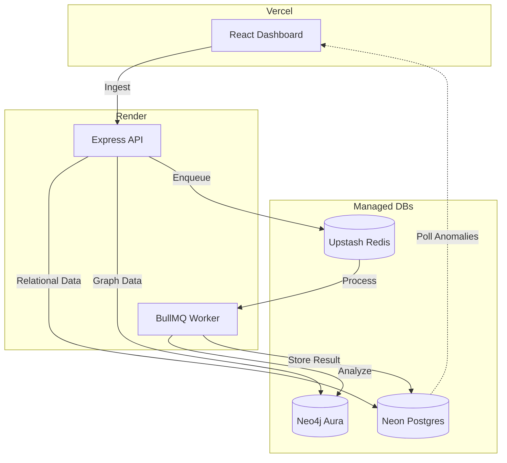
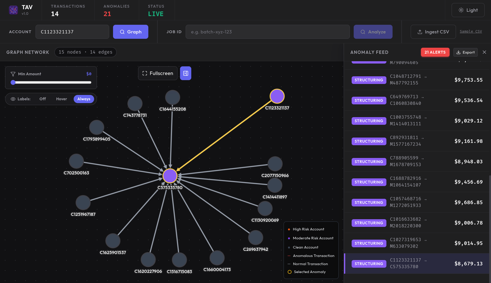
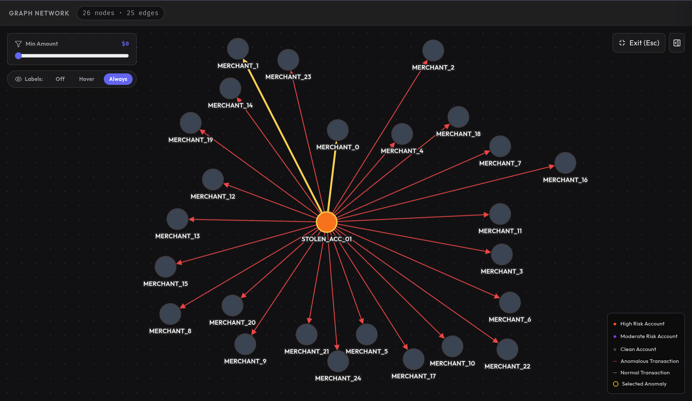

# Transaction Anomaly Visualizer (TAV)

[](https://transaction-anomaly-visualizer-dash.vercel.app/)
[](https://opensource.org/licenses/MIT)
[](https://nodejs.org/)
[](https://reactjs.org/)

**Transaction Anomaly Visualizer (TAV)** is a high-performance, distributed pipeline designed to detect and visualize fraudulent patterns in financial transaction networks. Leveraging a **Polyglot Persistence** architecture, it combines the relational power of PostgreSQL with the traversal efficiency of Neo4j to uncover complex money-laundering schemes in real-time.

---

## 🚀 Deployment & Live Access

### **[👉 View Live Dashboard](https://transaction-anomaly-visualizer-dash.vercel.app/)**

> **⚠️ Note on "Cold Starts":** This project is hosted on Render's free tier. If the dashboard feels unresponsive initially, please allow **30–50 seconds** for the backend services to "wake up" from their dormant state. Once active, the pipeline operates at full speed.

---

## 🏗️ Deployment Architecture

TAV is built with a modern, cloud-native architecture distributed across specialized managed services for maximum reliability and performance:

- **Frontend:** Hosted on **Vercel** for edge-optimized delivery and instant React rendering.
- **Backend API & Worker:** Deployed on **Render** (Web Service + Background Worker) using a custom monorepo Docker build.
- **Relational Store:** **Neon (PostgreSQL)** serves as the source of truth for raw transaction logs and detected anomaly metadata.
- **Graph Store:** **Neo4j Aura** provides a managed graph environment for high-speed relationship traversal.
- **Message Broker:** **Upstash (Redis)** handles asynchronous job queuing via BullMQ, ensuring the ingestion pipeline never blocks the UI.

---

## 🛠️ Tech Stack & Diagram

The system is built as a robust monorepo, separating core logic into a portable detection engine.



---

## 🔍 Detection Algorithms

TAV runs four specialized heuristic algorithms on every data batch:

1.  **DFS Cycle Detection:** Uncovers "Money Flow Obfuscation" loops (A → B → C → A).
2.  **BFS Velocity Check:** Identifies "Rapid Draining" (e.g., 20+ actions in 1 hour).
3.  **Threshold Proximity:** Flags "Structuring" (transactions clustered just below legal limits).
4.  **Timestamp Delta:** Detects automated bot-net activity via sub-minute transaction bursts.

---

## 📊 Visual Showcase

### **Real-Time Anomaly Feed**
The dashboard provides a prioritized list of detected anomalies, highlighted by impact and severity.



### **Network Subgraph Analysis**
Instantly visualize the 2-hop network of any account to understand its relationships and influence.



---

## 🛠️ Local Setup & Installation

### **1. Prerequisites**
- **Node.js** (v20+)
- **Docker & Docker Compose** (for local development)

### **2. Infrastructure Setup**
Bring up the PostgreSQL, Neo4j, and Redis containers:
```bash
docker-compose up -d postgres neo4j redis
```

### **3. Application Startup**
```bash
# From the root directory
npm install
npm run dev
```

- **Dashboard UI:** [http://localhost:5173](http://localhost:5173)
- **Express API:** [http://localhost:3000](http://localhost:3000)

---

## 📄 License

Distributed under the MIT License. See `LICENSE` for more information.
