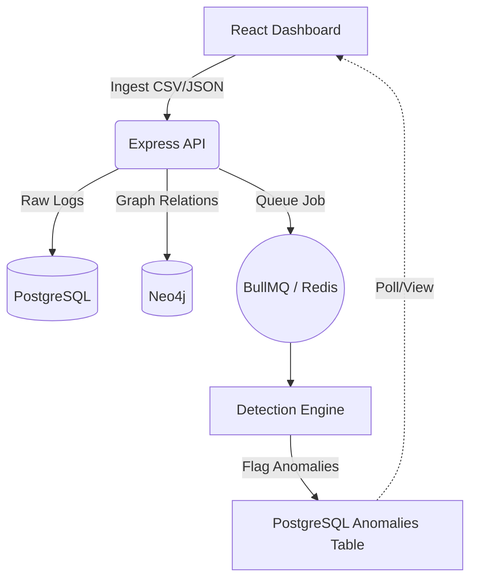
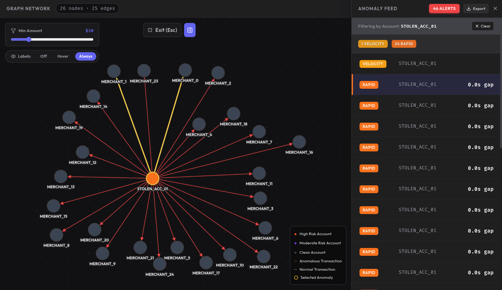

# Transaction Anomaly Visualizer (TAV)

[](https://opensource.org/licenses/MIT)
[](https://nodejs.org/)
[](https://reactjs.org/)
[](https://neo4j.com/)

**Transaction Anomaly Visualizer (TAV)** is a high-performance, distributed pipeline designed to detect and visualize fraudulent patterns in financial transaction networks. Leveraging a **Polyglot Persistence** architecture, it combines the relational power of PostgreSQL with the traversal efficiency of Neo4j to uncover complex money-laundering schemes in real-time.

---

## 🚀 Key Features

- **Distributed Pipeline:** Asynchronous ingestion and processing using BullMQ and Redis.
- **Graph-Based Analysis:** Real-time traversal of transaction networks to find hidden relationships.
- **Heuristic Detection Engine:** 4 built-in algorithms for identifying sophisticated fraud patterns.
- **Interactive Visualization:** High-fidelity graph rendering with Cytoscape.js and fCoSE layout.
- **Polyglot Persistence:** Optimized storage across PostgreSQL (logs), Neo4j (relationships), and Redis (queues).

---

## 🏗️ Architecture

The system is built as a robust monorepo, separating core logic into a portable detection engine.



---

## 🔍 Detection Algorithms

TAV runs four specialized heuristic algorithms on every data batch:

1.  **DFS Cycle Detection:** Uncovers "Money Flow Obfuscation" loops (A → B → C → A).
2.  **BFS Velocity Check:** Identifies "Rapid Draining" (e.g., 20+ actions in 1 hour).
3.  **Threshold Proximity:** Flags "Structuring" (transactions clustered just below legal limits).
4.  **Timestamp Delta:** Detects automated bot-net activity via sub-minute transaction bursts.

---

## 📊 Visual Showcase

### **Real-Time Anomaly Feed**
The dashboard provides a prioritized list of detected anomalies, highlighted by impact and severity.


### **Network Subgraph Analysis**
Instantly visualize the 2-hop network of any account to understand its relationships and influence.


### **Comprehensive Insights**
Track system health, ingestion throughput, and total anomaly counts across your entire pipeline.



---

## 🛠️ Setup & Installation

### **1. Prerequisites**
Ensure you have the following installed:
- **Docker & Docker Compose** (for database infrastructure)
- **Node.js** (v18+)
- **npm**

### **2. Infrastructure Setup**
Bring up the PostgreSQL, Neo4j, and Redis containers:
```bash
docker-compose up -d postgres neo4j redis
```

### **3. Application Startup**
Install dependencies and start the Backend and Dashboard concurrently:
```bash
# From the root directory
npm install
npm run dev
```

- **Dashboard UI:** [http://localhost:5173](http://localhost:5173)
- **Express API:** [http://localhost:3000](http://localhost:3000)

---

## 💡 Demo Guide: Professional Showcase

To demonstrate the full power of the system:

1.  **Download Sample Data:** Use the "Sample CSV" link in the dashboard.
2.  **Ingest:** Drag and drop the CSV into the Ingest panel.
3.  **Analyze:** Enter one of the realistic account IDs (e.g., `C764826684`) to see a 5rd-party cycle.
4.  **Explore:** Use the graph filters and export features to manage your findings.

---

## 📄 License

Distributed under the MIT License. See `LICENSE` for more information.
