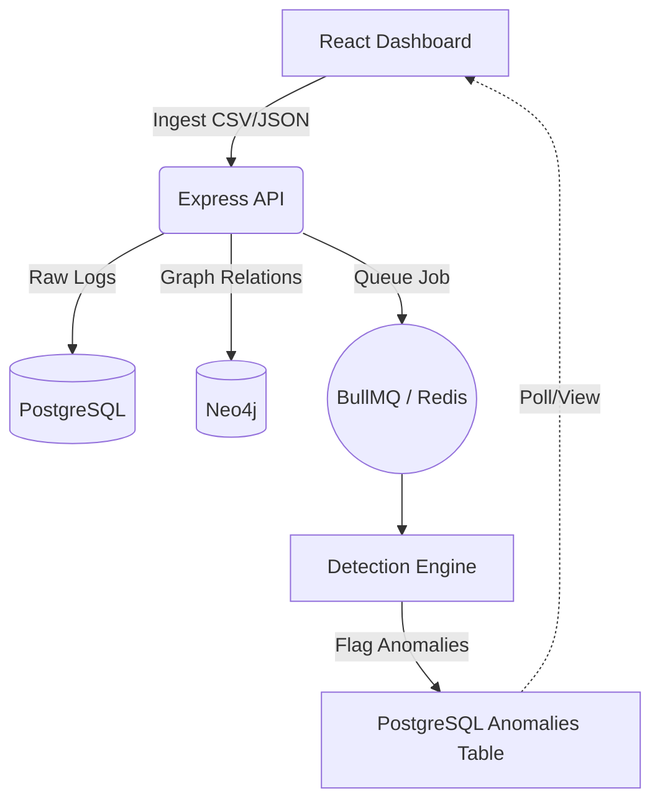
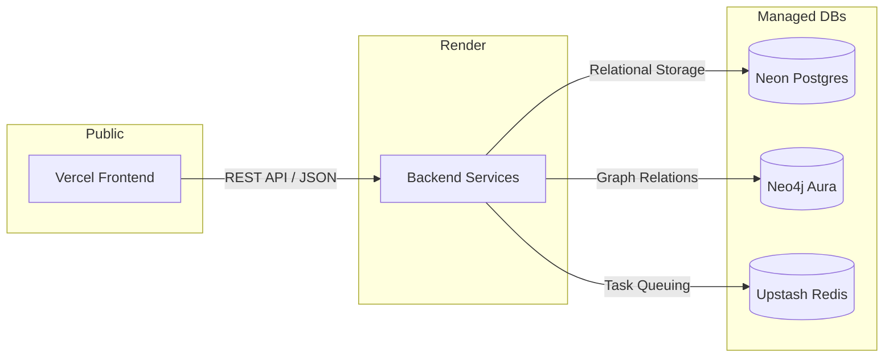

# Transaction Anomaly Visualizer (TAV)

[](https://transaction-anomaly-visualizer-dash.vercel.app/)
[](https://opensource.org/licenses/MIT)
[](https://nodejs.org/)
[](https://reactjs.org/)

**Transaction Anomaly Visualizer (TAV)** is a high-performance, distributed pipeline designed to detect and visualize fraudulent patterns in financial transaction networks. Leveraging a **Polyglot Persistence** architecture, it combines the relational power of PostgreSQL with the traversal efficiency of Neo4j to uncover complex money-laundering schemes in real-time.

---

## 🚀 Live Access

**[👉 View Live Dashboard](https://transaction-anomaly-visualizer-dash.vercel.app/)**

> **Note:** This project uses Render's free tier. The first request may take **30–50 seconds** to complete as the backend services wake up.
>
> To explore the live network visualization immediately, follow these simple steps:

1. **Download Sample Data:** Click the tiny **`Sample CSV`** link located right under the `Ingest CSV` button on the top right of the dashboard navigation bar.
2. **Upload & Process:** Click the main **`Ingest CSV`** button, select the downloaded `sample.csv` file, and upload it to trigger the background processing queues.
3. **Analyze the Batch:** Enter your generated batch ID into the **`JOB ID`** input field at the top and click **`Analyze`** to populate the prioritized real-time **Anomaly Feed** on the right panel.
4. **Visualize the Subgraph Network:** Copy any suspicious account ID flagged in the feed (for example, `C764826684`), paste it into the **`ACCOUNT`** input field on the top left, and click **`Graph`** to instantly render the multi-hop transaction cycle visually.

---

## 🏗️ System Architecture

The system is built as a robust monorepo, separating core logic into a portable detection engine.



---

## 🌐 Cloud Infrastructure & Data Flow

TAV is distributed across specialized managed services for optimal performance and scalability:



### **Challenges Overcome**
- **Monorepo Docker Orchestration**: Engineered a specialized Docker build process from the repository root to correctly resolve and bundle local workspace dependencies (`tav-detection-engine`) during deployment.
- **Cross-Provider Security**: Configured and optimized SSL/TLS handshaking across three distinct managed providers (Neon, Aura, and Upstash) to ensure secure data transit in a distributed environment.
- **Multi-Database State Synchronization**: Orchestrated complex state management across relational (PostgreSQL) and graph (Neo4j) models to maintain data integrity and consistency during high-throughput ingestion.

---

## 🔍 Detection Algorithms

TAV runs four specialized heuristic algorithms on every data batch:

1.  **DFS Cycle Detection:** Uncovers "Money Flow Obfuscation" loops (A → B → C → A).
2.  **BFS Velocity Check:** Identifies "Rapid Draining" (e.g., 20+ actions in 1 hour).
3.  **Threshold Proximity:** Flags "Structuring" (transactions clustered just below legal limits).
4.  **Timestamp Delta:** Detects automated bot-net activity via sub-minute transaction bursts.

---

## 📊 Visual Showcase

### **Real-Time Anomaly Feed**
The dashboard provides a prioritized list of detected anomalies, highlighted by impact and severity.


### **Network Subgraph Analysis**
Instantly visualize the 2-hop network of any account to understand its relationships and influence.


---

## 🛠️ Local Setup & Installation

### **1. Prerequisites**
- **Node.js** (v20+)
- **Docker & Docker Compose** (for local infrastructure)

### **2. Infrastructure Setup**
Bring up the PostgreSQL, Neo4j, and Redis containers:
```bash
docker-compose up -d postgres neo4j redis
```

### **3. Application Startup**
```bash
# From the root directory
npm install
npm run dev
```

- **Dashboard UI:** [http://localhost:5173](http://localhost:5173)
- **Express API:** [http://localhost:3000](http://localhost:3000)

---

## 📄 License

Distributed under the MIT License. See `LICENSE` for more information.
