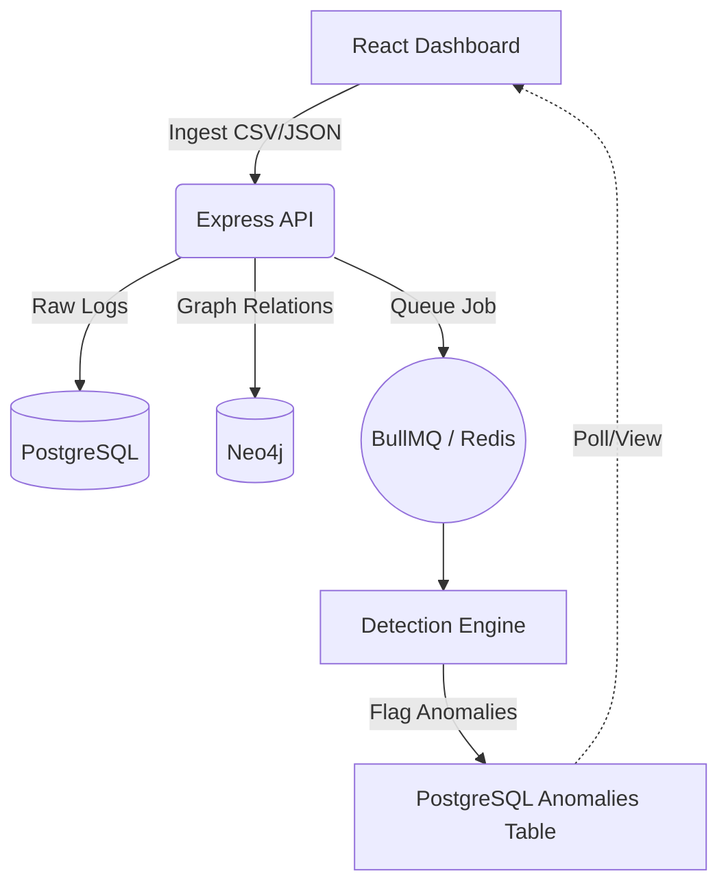

# Transaction Anomaly Visualizer (TAV)

A high-performance, distributed pipeline for detecting fraudulent patterns in financial transaction networks using graph-based analysis (Neo4j), relational data (PostgreSQL), and asynchronous task queuing (BullMQ).

## 🚀 Overview

TAV is designed to ingest massive transaction datasets and autonomously flag suspicious activity. It uses a **Polyglot Persistence** architecture, leveraging the strengths of both relational and graph databases to provide a comprehensive view of financial networks.


### 🏗️ Architecture



---

## 🔍 Detection Algorithms

The system runs four core heuristic algorithms on every ingested batch:

1.  **DFS Cycle Detection:** Identifies "Money Flow Obfuscation" where funds are routed through multiple accounts (A → B → C → A) to hide their origin.
2.  **BFS Velocity Check:** Detects "Rapid Draining" where an account performs an abnormal number of transactions (e.g., 10+ actions) within a 60-minute window.
3.  **Threshold Proximity:** Flags "Structuring" or "Smurfing"—transactions clustered just below legal reporting limits (e.g., $9,500–$9,999).
4.  **Timestamp Delta:** Identifies automated bot-net activity where transactions occur with sub-60-second precision.

---

## 🛠️ Setup & Installation

### 1. Prerequisites
- Docker & Docker Compose
- Node.js (v18+)
- npm

### 2. Infrastructure
Bring up the backing stores (Postgres, Neo4j, and Redis):
```bash
docker-compose up -d postgres neo4j redis
```

### 3. Local Development
Install dependencies and start the services concurrently:
```bash
# From the root directory
npm install
npm run dev
```
- **Dashboard:** [http://localhost:5173](http://localhost:5173)
- **API Backend:** [http://localhost:3000](http://localhost:3000)

---

## 📊 Demo: PaySim Stress Test

To see the system in action with real-world scale data:

1.  Open the **Dashboard**.
2.  Use the **Ingest Panel** on the left.
3.  Upload the provided `paysim_stress_50k.csv` file.
4.  The system will enqueue multiple batches. Watch the **Anomaly Feed** on the right populate as the detection engine flags transactions.
5.  Click on any flagged account to visualize its **2-hop subgraph** in the main canvas.

---

## 📦 Tech Stack

- **Frontend:** React, Vite, TailwindCSS, Cytoscape.js (Graph Visualization).
- **Backend:** Node.js, Express, BullMQ (Queue Management).
- **Databases:** PostgreSQL (Relational), Neo4j (Graph), Redis (Job Queue).
- **Engine:** Standalone NPM package `tav-detection-engine` for portable fraud logic.

---

## 📄 License
Distributed under the MIT License. See `LICENSE` for more information.
